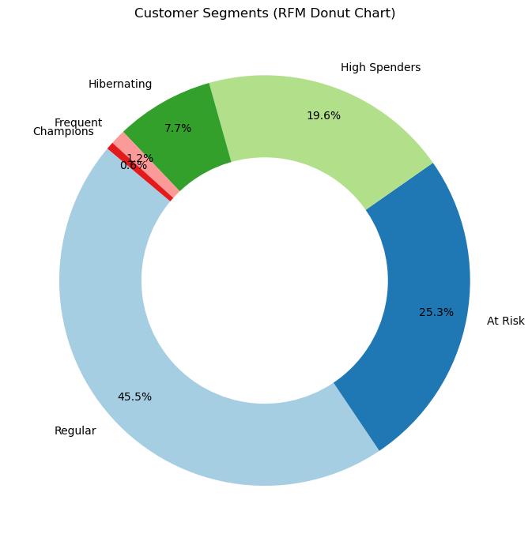
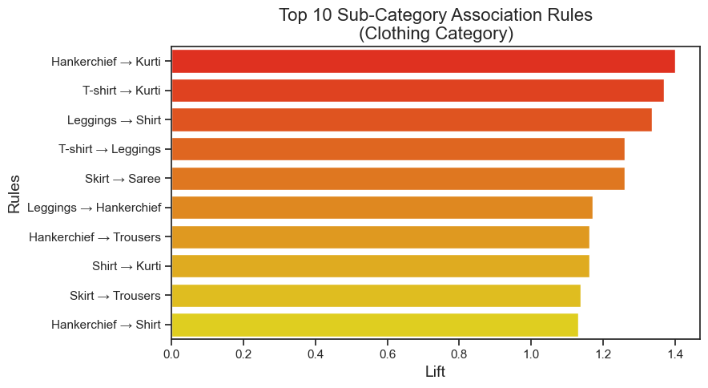
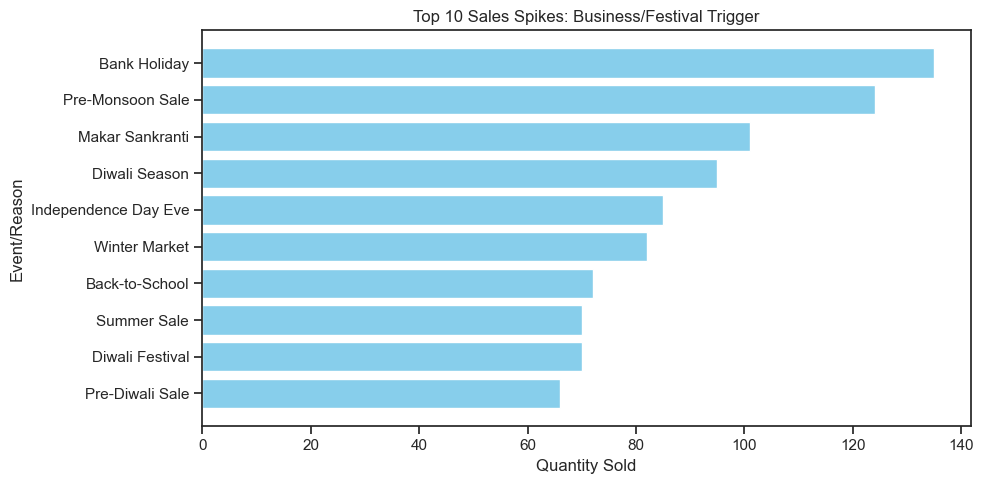

  <h1 align="center">🛒 Retail Sales Analytics</h1>
  

    Transforming raw retail data into actionable business insights 📊
  

  
  
  

---

## 📌 Project Overview

This project delivers an **end-to-end retail analytics solution** using Python to uncover hidden patterns in customer behavior, product associations, and seasonal sales trends.

✔️ Built using real-world retail data  
✔️ Focused on **business-driven insights**  
✔️ Designed for **decision-making & strategy**

---

## 🎯 Key Highlights

✨ Customer Segmentation using **RFM + K-Means**  
✨ Market Basket Analysis for **cross-selling strategies**  
✨ Sales Spike Detection based on **events & festivals**  
✨ Interactive Visualizations for **clear insights**

---

## 🛠️ Tech Stack

  <!-- Dev Tools -->
  
  
  
  
  
  

---

## 📊 Business Problems Solved

- 🧠 How to segment customers based on behavior?
- 🛍️ Which products are frequently bought together?
- 📈 What drives sudden spikes in sales?
- 🎯 How to improve retention and cross-selling?

---

## 🔍 Key Insights

### 👥 Customer Segmentation (RFM) [🔗](notebook/1_RFM_Analysis.ipynb)

- 45% customers are **regular buyers**
- 25% are **at-risk customers** (high churn probability)
- 19% are **high-value customers**

👉 Opportunity: Targeted retention & loyalty programs

---

### 📦 Market Basket Analysis [🔗](notebook/3_Basket_analysis.ipynb)

- Strong associations found between:
  - Clothing + Accessories
  - Phones + Accessories
  - Chairs + Tables  

👉 Opportunity: Bundling & cross-selling strategies

---

### 📅 Sales Spike Analysis [🔗](notebook/4_Highest_spikes.ipynb)

- Highest spikes during:
  - 🎉 Diwali & Festivals  
  - 🏖️ Seasonal Sales  
  - 🏦 Bank Holidays  

👉 Opportunity: Inventory & marketing optimization

---

## 📈 Visual Insights

  
  

  
  

---

## ⚡ Business Impact

✔️ Improved customer targeting using segmentation  
✔️ Identified high-value product bundles  
✔️ Enabled data-driven marketing strategies  
✔️ Highlighted key revenue-driving events  

---

## 📚 What I Learned

- Real-world data cleaning & preprocessing  
- Customer segmentation techniques (RFM + Clustering)  
- Association rule mining for product insights  
- Translating data into **business decisions**

---

## 🚧 Challenges

- Handling messy & inconsistent datasets  
- Choosing optimal clustering parameters  
- Interpreting results in business context  

---

## 🎯 Conclusion

This project demonstrates how **data analytics can directly drive business growth** by improving customer understanding, optimizing marketing strategies, and identifying revenue opportunities.

---

  ⭐ If you found this useful, consider giving it a star!

